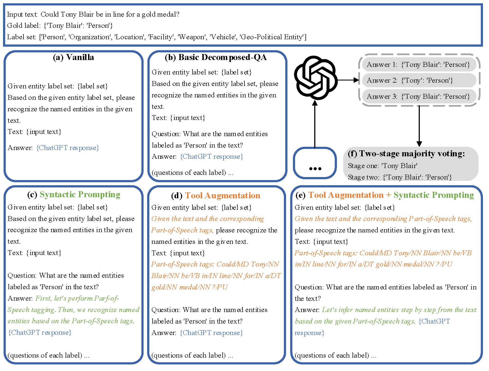

# Empirical Study of Zero-Shot NER with ChatGPT

This is the github repository for the paper to be appeared at EMNLP 2023 main conference: [Empirical Study of Zero-Shot NER with ChatGPT](https://arxiv.org/abs/2310.10035).

## Introduction

This work focuses on exploring LLM performance on zero-shot information extraction, with a focus on the ChatGPT and named entity recognition (NER) task.



Inspired by the remarkable reasoning capability of LLM on symbolic and arithmetic reasoning, we adapt the prevalent reasoning methods to NER and propose reasoning strategies tailored for NER:
* We break down the NER task into a series of simpler subproblems by labels and perform a decomposed-question-answering (**Decomposed-QA**) paradigm, where the model extracts entities of only one label at a time.
* We propose syntactic augmentation of two ways: **syntactic prompting**, which encourages the model to first analyze the syntactic structure of the input text itself, then recognize the named entities based on the syntactic structure; **tool augmentation**, which provides the syntactic information generated by a parsing tool to the model.
* We tailor the self-consistency (SC) for NER and propose a **two-stage majority voting strategy**: after sampling multiple responses of the model, we first vote for the most consistent mentions, then the most consistent types.

Please find more details of this work in our [paper](https://arxiv.org/abs/2310.10035).

## Usage

### Requirements
We run our code on Windows. The following are the dependencies:
python 3.8, openai 0.27.4, pytorch 2.0.1, pandas, hanlp

### Datasets
We provide processed datasets used in our paper at the [Google Drive](https://drive.google.com/file/d/1OThhbY6IkO1vJuseLijQD5qyUoQ27dJk/view?usp=share_link), except [ACE04](https://catalog.ldc.upenn.edu/LDC2005T09), [ACE05](https://catalog.ldc.upenn.edu/LDC2006T06) and [Ontonotes 4](https://catalog.ldc.upenn.edu/LDC2011T03) for copyright reasons. Power plant datasets, PowerPlantFlat and PowerPlantNested, involve ongoing collaborative projects with our partners, and we will release them after the project is completed and the data is desensitized.

You can download the dataset files and put them in the [data](data) folder.

We provide five randomly sampled test samples of [MSRA](https://paperswithcode.com/dataset/msra-cn-ner) in [msra_5_samples](data/msra_5_samples) for quick start.

### Run
We provide shell scripts in folder [scripts](scripts) for quick start on a few sampled examples [msra_5_samples](data/msra_5_samples). Each script can be used to quickly run the pipeline of (1) generating prompts, (2) run LLM and (3) computing the evaluation results.

We use Pos tagging as the example syntactic information in all related scripts. The generated prompts will be saved to folder [prompts](prompts). The response from the LLM and the evaluation results will be saved to folder [result](result). The output files generated after running the following commands are provide in this repository for demonstration.

Run the following commands to use our methods. We recommend using the syntactic augmentation and SC methods under the proposed decomposed-QA paradigm, where these strategies exhibit more potential than in the vanilla paradigm.

Before you run on ChatGPT, please set your OpenAI API Keys in `my_openai_api_keys` in [const.py](code/const.py).

```shell
# Vanilla paradigm
# Basic
sh scripts/msra_5_samples_zs_vanilla.sh
# Syntactic prompting
sh scripts/msra_5_samples_zs_vanilla_syn.sh
# Tool augmentation
sh scripts/msra_5_samples_zs_vanilla_tool.sh
# Tool augmentation with syntactic prompting
sh scripts/msra_5_samples_zs_vanilla_tool_syn.sh
# Combination of tool augmentation, syntactic prompting and SC
sh scripts/msra_5_samples_zs_vanilla_tool_syn_SC5.sh

# Decomposed-QA paradigm
# Basic
sh scripts/msra_5_samples_zs_qa.sh
# Syntactic prompting
sh scripts/msra_5_samples_zs_qa_syn.sh
# Tool augmentation
sh scripts/msra_5_samples_zs_qa_tool.sh
# Tool augmentation with syntactic prompting
sh scripts/msra_5_samples_zs_qa_tool_syn.sh
# Combination of tool augmentation, syntactic prompting and SC
sh scripts/msra_5_samples_zs_qa_tool_syn_SC5.sh
``` 

### Arguments

**Decomposed-QA**
* `--order`: Default set to `chatgpt0` for most dataset, using the label order generated by ChatGPT. You can explore other label orders by adding your own label order in `dataset_label_order_map` in the [const.py](code/const.py)
  
**Syntactic prompting**
* `--reason_hint`. Choose the type of syntactic information. (1) Choices for only using syntactic prompting: `tok_conj` means word segmentation (Chinese only). `pos_conj` means POS tags. `con_conj` means constituency trees. `dep_conj` means dependency trees. (2) Choices for using both tool augmentation and syntactic prompting: `ToolUseTok` means word segmentation (Chinese only). `ToolUsePos` means POS tags. `ToolUseCon` means constituency trees. `ToolUseDep` means dependency trees.
* `--reason_hint_pos`. Choose the position in the whole prompt to put the syntactic reasoning hint. Choices: `f` means put it in the front of the prompt. `b` means put it in the back of the prompt.
* `--reason_hint_person`. Choose the personal pronoun used in the prompt. Choices: `first` means the first person, which is used when `--reason_hint_pos` is set to `b`. `second` means the second person, which is used when `--reason_hint_pos` is set to `f`.

**Tool augmentation**
* `--tool_aug`. Choose the type of syntactic information. Choices: `ToolTokCoarse` means word segmentation (Chinese only), we defaultly use the coarse-grained segmentation. `ToolPos` means POS tags. `ToolCon` means constituency trees. `ToolDep` means dependency trees.

**Self-consistency (SC)**
* `--consistency`. `0` means no SC, `1` means using SC with two-stage majority voting.
* `--temperature`. `0` for not using SC; default set to `0.7` for SC.
* `--consis_level`. On which level to conduct SC. Only active under decomposed-QA. Choices: `question` means on the question-level. `sample` means on the sample-level. 
* `--query_times`. Number of sampled responses in SC. We defaultly set to `5` in our main experiments.


### Generate syntactic information
Use the python script [here](parsing/batch_hanlp_tok_pos_con_dep.py) to generate syntactic information with [Hanlp](https://github.com/hankcs/HanLP).
